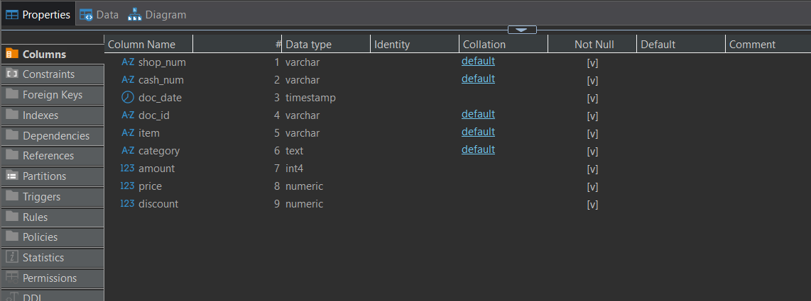
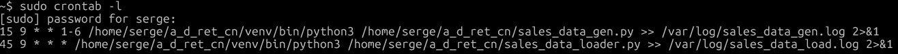
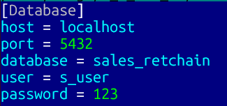
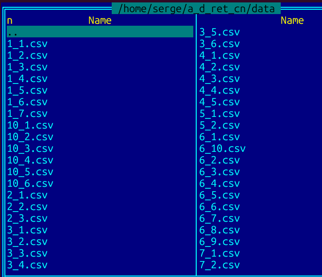
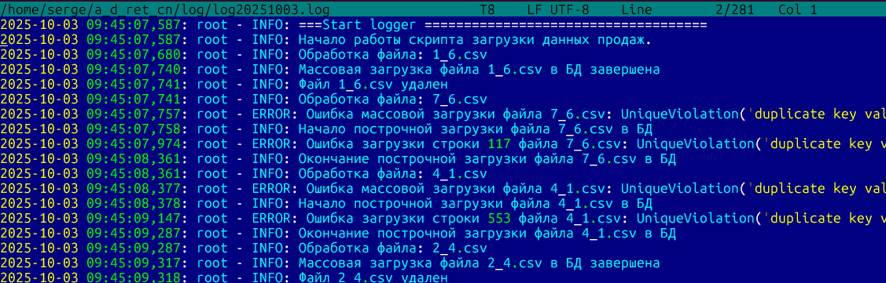

# Автоматизация обработки чеков торговой сети
В проекте реализована генерация данных продаж торговой сети,
автоматизация сбора и хранения информации для анализа данных.

Задание на разработку здесь: [Описание задачи](./task.md) 

## Структура репозитория
- Папка data - примеры сгенерированных выгрузок
- Папка sql - DDL команды для создания БД `user_and_db_create.sql` и скрипт для создания таблиц `create_tbl.py`.
- В корне репозитория:
    * `config.ini` - файл конфигурации для подключения к серверу postgresql
    * `add_task.sh` - скрипт создания заданий cron
    * `sales_data_gen.py` - скрипт генерации выгрузок касс из магазинов
    * `sales_data_loader.py` - скрипт обработки файлов выгрузок касс и загрузки данных в БД
    * `requirements.txt` - файл зависимостей python

## Развёртывание на сервере Linux

После подключения к серверу

1. перейти в домашнюю папку 
    * `cd ~`
2. скопировать репозиторий git
    * `git clone https://github.com/krutse/a_d_ret_cn.git`
    * Перейти в новую папку репозитория `cd a_d_ret_cn.git`
3. создать виртуальное окружение python
    * `apt install python3.12-venv`  - тут 3.12 установленная версия python
    * `./venv/bin/python3 -m venv venv`
4. установить зависимости библиотек python
    * `./venv/bin/pip install -r requirements.txt`
5. установить postgresql
    * `sudo apt update`
    * `sudo apt-get -y install postgresql`
    * установить пароль пользователю `postgres`: `sudo passwd postgres`
6. Создать пользователя и БД
    * переключиться на пользователя `postgres`: `su - postgres`
    * выполнить в psql DDL команды из файла [/sql/user_and_db_create.sql](./sql/user_and_db_create.sql) 
    * Запустить скрипт создания таблиц 
	* `cd ~/a_d_ret_cn.git`
        * `./venv/bin/python3 ./sql/create_tbl.py`
        
	Пример созданной таблицы:
	

    
7. Запустить скрипт создания заданий cron
    * сделать файл исполняемым: `chmod +x add_task.sh`
    * выполнить скрипт `sudo add_task.sh`
    
        Будут добавлены задания в cron:

    

## Этапы работы

### Настройки 
В файле `config.ini` задаются параметры подключения к БД

Пример:

### Генерация данных касс магазинов
Генерация данных производится каждый день кроме воскресенья в 3:00. 

Имя файла: `{shop_num}}_{{cash_num}}.csv` Здесь `{{shop_num}}`- номер магазина, а `{{cash_num}}`- номер кассы.

Формат файла:

- *__`doc_id`__ - численно-буквенный идентификатор чека*
- *__`item`__ - название товара*
- *__`category`__ - категория товара (бытовая химия, текстиль, посуда и т.д.)*
- *__`amount`__ - кол-во товара в чеке*
- *__`price`__ - цена одной позиции без учета скидки*
- *__`discount`__ - сумма скидки на эту позицию (может быть 0)*

Пример сгенерированных данных:

### Обработка и загрузка в БД
Загрузка данных производится ежедневно в 4:00. Успешно загруженные файлы удаляются.

Пример автоматизации в cron:

### Логирование
При загрузке данных формируется лог-файл в папке ./log. Старые логи удаляются по истечении 10 дней.

Пример работы log-файла

